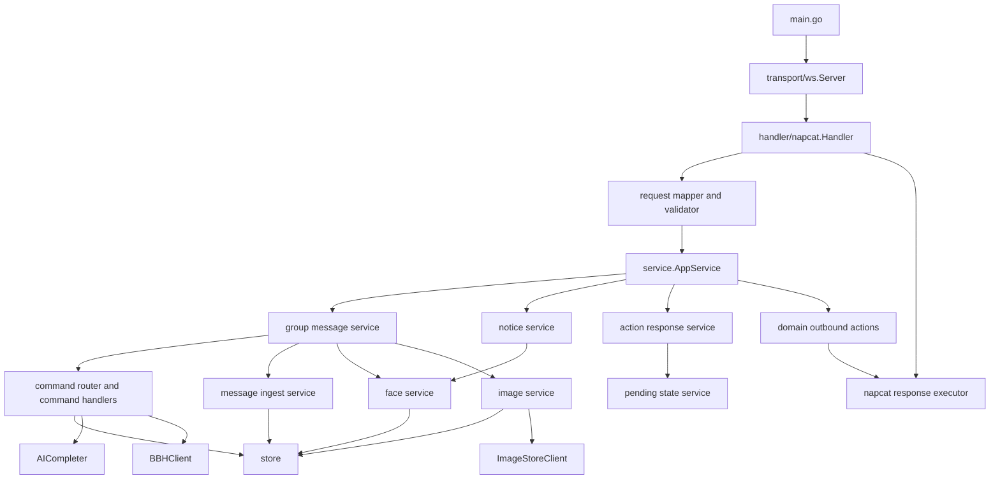

# internal/service 调研与架构拆分方案

## 1. 当前结构调研清单

### 1.1 目录现状总览

当前 `internal/service` 目录下没有子目录，全部代码均平铺在同一 package `service` 中。该目录同时承载了以下多种职责：

- Service 装配与状态管理
- NapCat 入站消息入口与出站发送
- 命令匹配、命令分发、命令实现
- 消息入库、表情入库、图片处理
- SQL 访问封装与统计查询
- 报告格式化与通用辅助函数
- 单元测试

### 1.2 文件树

```text
internal/service
├── command_ai.go
├── command_allface.go
├── command_bbh.go
├── command_dice.go
├── command_face.go
├── command_faceid.go
├── command_getfaceid.go
├── command_image_to_file.go
├── command_json.go
├── command_symmetric.go
├── command_symmetric_test.go
├── commands.go
├── face_storage.go
├── format.go
├── helpers.go
├── image.go
├── image_test.go
├── prompts.go
├── report.go
├── service.go
├── service_ingest.go
├── service_ingress.go
├── service_test.go
├── state.go
└── store.go
```

### 1.3 文件职责明细

| 文件 | 当前核心职责 | 主要依赖 | 备注 |
| --- | --- | --- | --- |
| `service.go` | 定义 `Service` 聚合对象、`AICompleter`、`outboundWriter`，负责 `NewService` 装配 | `config`、`gorm`、`client/bbh`、`client/imagestore` | 当前同时承担“依赖注入容器”和“业务总入口对象”双重角色 |
| `service_ingress.go` | 处理 `notice`、`group_message`、`action_response`；统一发送文本、图片、segments、emoji like 动作 | `napcat`、`encoding/json` | NapCat 强耦合最重，是后续拆分的核心切割点 |
| `service_ingest.go` | 负责入站消息解析后的持久化：消息、@用户、图片、机器人自发消息回填 | `napcat`、`dal/model` | 同时包含“入站消息解析后的保存”和“回执补写” |
| `commands.go` | 命令匹配、命令分发、handler 绑定 | `napcat`、`regexp` | 是命令系统总路由 |
| `prompts.go` | 定义命令枚举、命令正则、帮助文本、AI prompts | 无复杂外部依赖 | 注册表性质文件 |
| `command_ai.go` | `.概括`、`.总结`、`.俳句`、`.无只因`、`.最`、`.vs`、`.ccb`、`.xmas`、`.ai`、`.aic`、`.报告`、NJK 回复 | `Store`、`AICompleter` | 命令聚合度最高 |
| `command_bbh.go` | `.bbh` 全套命令，包括查询、范围读取、接龙、AI 接龙 | `client/bbh`、`AICompleter`、`Store` | 同时依赖外部 BBH 与 AI |
| `command_face.go` | `.face`，读取历史消息中的 face 段并贴表情 | `Store`、`napcat` | 输出动作型结果 |
| `command_faceid.go` | `.faceid`，按单个或范围构造系统表情 segments | `napcat` | 输出 segment 列表，并附带 emoji like 动作 |
| `command_getfaceid.go` | `.getfaceid`，查询最近消息的“发/贴”表情 ID | `Store` | 查询结果文本化 |
| `command_allface.go` | `.allface`，列出系统表情全集与贴过的表情全集 | `Store` | 纯查询 |
| `command_json.go` | `.json`，回显最近已保存消息的 `raw_json` | `Store` | 面向调试与数据查看 |
| `command_image_to_file.go` | `.file`，把图片按 file segment 发出 | `Store` | 媒体输出命令 |
| `command_dice.go` | `.XdY` 掷骰子 | `rand` | 纯计算命令 |
| `command_symmetric.go` | `.对称*` 系列图片加工命令，兼容静态图和 GIF | `Store`、`ImageService`、`ImageStoreClient` | 与图片系统深度耦合 |
| `face_storage.go` | 系统表情解析、notice emoji_like 落库、face ID 排序 | `Store`、`napcat` | 属于表情子域的存储辅助 |
| `image.go` | 图片下载、pHash 计算、白名单、相似图查重 | `Store`、`http`、图片解码库 | 典型领域服务 |
| `store.go` | 对 `user/group/message/at_user/face/emoji_like/image` 等表的读写与统计查询 | `gorm`、`dal/model` | 当前 data access layer 实际入口 |
| `report.go` | 报告统计结果格式化 | 无复杂外部依赖 | 纯格式化 |
| `state.go` | `pendingOutbound`、`pendingQueue`、续聊状态 | `sync` | 发送链路状态管理 |
| `helpers.go` | 常用 outbound 构造、随机等待、起始时间计算、结构转 key-value | 基础库 | 辅助工具集 |
| `format.go` | 文本归一化、时间显示格式化 | `strings`、`time` | 纯格式化 |
| `service_test.go` | 命令匹配、表情逻辑、段发送、骰子、格式化、黑名单等测试 | `testing` | 综合测试 |
| `command_symmetric_test.go` | 对称图方向与图片处理测试 | `testing` | 图片命令专项测试 |
| `image_test.go` | pHash 兼容性测试 | `testing` | 图片子系统专项测试 |

### 1.4 当前代码组织方式

当前 `internal/service` 的组织方式本质上是“单 package 聚合式架构”：

1. `main.go` 调用 `service.NewService(...)` 构造统一 Service 对象。
2. `internal/transport/ws/server.go` 将 NapCat 入站消息直接分发给 `Service.HandleNotice`、`Service.HandleGroupMessage`、`Service.HandleActionResponse`。
3. `HandleGroupMessage` 同时负责：
   - NapCat 事件对象校验
   - 群白名单和用户黑名单校验
   - `@bot` 识别
   - face 提取
   - 命令匹配
   - 触发消息入库
   - 执行业务命令
   - 统一发送响应
4. 命令实现直接访问 `Store`、`ImageService`、`AICompleter`、`BBHClient`、`ImageStoreClient`。
5. 发送链路和回执链路仍留在 `service` 包内，因此“业务决策”和“NapCat 协议适配”处于混合状态。

### 1.5 模块依赖与调用关系

#### 1.5.1 启动链路

```text
main.go
  -> config.Load()
  -> postgres.InitDB(cfg.DSN())
  -> service.NewService(...)
  -> ws.NewServer(cfg.ListenAddr, botService)
  -> server.ListenAndServe()
```

#### 1.5.2 入站调用链

```text
NapCat WebSocket 推送
  -> transport/ws/server.go
  -> napcat.ParseInboundMessage(...)
  -> Service.HandleNotice(...) / HandleGroupMessage(...) / HandleActionResponse(...)
```

#### 1.5.3 GroupMessage 主链

```text
HandleGroupMessage
  -> 白名单/黑名单校验
  -> saveFacesFromGroupMessage
  -> matchCommand
  -> mentionsBot 时回退 commandNJK
  -> saveIncomingMessageAndCheckImages
  -> handleMatchedCommand / handleNJKReply
  -> sendGroupText / multiSendSegments / multiSendGroupImages / setMsgEmojiLike
```

#### 1.5.4 ActionResponse 主链

```text
HandleActionResponse
  -> 解析 send_group_msg 回执
  -> pendingQueue.Pop()
  -> saveSelfMessage
  -> Store.SaveMessage(...)
```

#### 1.5.5 当前外部依赖矩阵

| 当前模块 | 依赖对象 | 依赖方式 |
| --- | --- | --- |
| `service.go` | `client/ai` | 通过 `AICompleter` 接口注入 |
| `service.go` | `client/bbh` | 通过 `*BBHClient` 注入 |
| `service.go` | `client/imagestore` | 直接实例化 |
| `service_ingress.go` | `napcat` | 直接使用 NapCat 事件与请求结构 |
| `service_ingest.go` | `napcat` | 直接读取 NapCat message segments |
| `store.go` | `gorm`、`dal/model` | 直接做 ORM/SQL 读写 |
| `image.go` | `Store`、HTTP 下载能力 | 直接下载图片并做 pHash |
| `command_*` | `Store`、`ImageService`、AI/BBH client | 直接执行业务逻辑 |

### 1.6 当前对外暴露的核心业务方法清单

#### 1.6.1 package 级公开入口

这些是当前真正被 `internal/service` 包外部直接调用或可复用的导出方法：

| 方法 | 归属 | 当前职责 |
| --- | --- | --- |
| `NewService(cfg, db, aiClient, freeAIClient, bbhClient)` | `service.go` | 构造核心 Service，注入依赖、编译命令表 |
| `(*Service).HandleNotice(ctx, conn, clientAddr, event)` | `service_ingress.go` | 处理 notice 消息入口 |
| `(*Service).HandleGroupMessage(ctx, conn, clientAddr, event)` | `service_ingress.go` | 处理群消息入口 |
| `(*Service).HandleActionResponse(ctx, action)` | `service_ingress.go` | 处理 NapCat action 回执入口 |

#### 1.6.2 目录内对业务有实际意义的导出能力

虽然以下方法多数由 `service` 包内部使用，但它们已经形成事实上的“公共能力面”，后续拆分时需要保留或重构为明确接口：

| 方法 | 归属 | 当前职责 |
| --- | --- | --- |
| `NewStore(db)` | `store.go` | 构造数据访问对象 |
| `(*Store).UpsertUser(...)` | `store.go` | 用户 upsert |
| `(*Store).UpsertGroup(...)` | `store.go` | 群组 upsert |
| `(*Store).FindUser(...)` | `store.go` | 查询用户 |
| `(*Store).FindMessage(...)` | `store.go` | 查询消息 |
| `(*Store).SaveMessage(...)` | `store.go` | 保存消息 |
| `(*Store).SaveAtUser(...)` | `store.go` | 保存 @ 关系 |
| `(*Store).UpsertFace(...)` | `store.go` | face ID upsert |
| `(*Store).SaveEmojiLike(...)` | `store.go` | 保存表情回应 |
| `(*Store).EnsureNoticeMessage(...)` | `store.go` | 为 notice 目标消息补占位 message |
| `(*Store).SaveImage(...)` | `store.go` | 保存图片记录 |
| `(*Store).IsHashWhitelisted(...)` | `store.go` | 查询图片 hash 白名单 |
| `(*Store).AddWhitelistHash(...)` | `store.go` | 写入图片 hash 白名单 |
| `(*Store).RecentMessages(...)` | `store.go` | 读取最近消息 |
| `(*Store).RecentMessageImages(...)` | `store.go` | 读取最近消息关联图片 |
| `(*Store).RecentFaceIDRows(...)` | `store.go` | 读取最近消息的发/贴表情 ID |
| `(*Store).AllFaceIDs(...)` | `store.go` | 查询全量表情 ID |
| `(*Store).MessagesSince(...)` | `store.go` | 查询指定时间后的消息 |
| `(*Store).GroupImageCandidates(...)` | `store.go` | 获取图片查重候选集 |
| `(*Store).ReportStats(...)` | `store.go` | 查询报告统计结果 |
| `NewImageService(store)` | `image.go` | 构造图片领域服务 |
| `(*ImageService).SaveAndCheckDuplicate(...)` | `image.go` | 下载、入库、计算 hash、查重 |
| `(*ImageService).EnsureEmojiWhitelist(...)` | `image.go` | 处理动画表情白名单 |

### 1.7 当前问题与拆分动因

当前结构存在以下拆分必要性：

1. `service_ingress.go` 直接依赖 NapCat 事件结构，导致业务层无法脱离消息接入框架单独演化。
2. `HandleGroupMessage` 同时承担“协议入口、校验、业务编排、发送执行”四类职责，方法过重。
3. 命令处理逻辑与消息发送逻辑混在同一层，难以定义稳定的 service API。
4. 出站能力依赖 `pendingQueue` 与 NapCat `send_group_msg` 细节，业务层不能表达为协议无关的“领域动作”。
5. store、image、face、command 等本应属于领域服务的代码，被统一包裹在一个大 package 中，后续扩展容易继续膨胀。

## 2. AGENTS.md 内容甄别与有效规则提取

### 2.1 已明显过时的内容

| AGENTS 描述 | 当前状态 | 甄别结论 |
| --- | --- | --- |
| 程序入口是 `cmd/server/main.go` | 实际入口是项目根目录 `main.go` | 过时 |
| 核心业务目录是 `internal/bot/` | 实际目录是 `internal/service/` | 过时 |
| AI、BBH、Image Store 在 `internal/ai`、`internal/bbh`、`internal/imagestore` | 实际已迁到 `internal/client/ai`、`internal/client/bbh`、`internal/client/imagestore` | 过时 |
| model/query 位于 `internal/model`、`internal/query` | 实际使用路径为 `internal/dal/model`、`internal/dal/query` | 过时 |
| 调试脚本为 `run_ws_server.sh` | 实际脚本为 `run.sh` | 过时 |
| `.env.example` 未列出 `BBH_BASE_URL` | 当前示例配置已包含 `BBH_BASE_URL` | 过时 |
| 只有文本消息进入 `pendingQueue` | 当前图片/file/segments 发送也会入队，只是 `ShouldSave=false` | 过时 |
| 当前命令清单未包含 `.json`、`.file` | 代码中已存在这两个命令 | 过时 |

### 2.2 仍具参考价值的有效规则

以下内容虽然文档路径和个别命名过时，但其架构约束和业务逻辑仍然与当前项目高度一致：

#### 2.2.1 项目架构规范

1. 项目仍然是基于 NapCat 反向 WebSocket 的群聊机器人。
2. 启动主链仍然是“配置加载 -> 数据库初始化 -> 业务 Service 装配 -> WS 服务启动”。
3. 命令系统仍然采用“命令定义注册 -> 正则编译 -> 分发到 handler”的组织方式。
4. 图片、AI、BBH、系统表情、消息入库等能力仍然属于核心业务域，不应分散到入口层。

#### 2.2.2 消息流转逻辑

1. WebSocket 层只负责接收文本帧并解析为 NapCat 入站事件。
2. 入站事件类型仍是三大类：`group_message`、`notice`、`action_response`。
3. 群消息处理顺序仍应遵守：
   - 群白名单过滤
   - 用户黑名单过滤
   - 提前提取 face ID
   - 命令匹配
   - `@bot` 时回退到 NJK 对话逻辑
   - 仅在“无命令”或 “commandNJK” 时先入库
   - 统一产生出站动作
4. `group_msg_emoji_like` notice 必须优先处理，并从 `likes[].emoji_id` 提取表情 ID。
5. `action_response` 当前主要服务于 `send_group_msg` 成功回执与“机器人自发消息补写入库”。

#### 2.2.3 模块职责划分要求

1. 图片查重和图片白名单属于图片领域服务，不应散落在消息入口层。
2. face 与 emoji_like 的 upsert、查询、占位 message 补写属于表情子域职责。
3. `raw_json` 既可能是 segments 数组，也可能是 JSON 编码字符串，读取逻辑必须具备容错能力。
4. 文本、segment、图片/file、emoji like 动作属于不同出站类型，后续拆分时需要保留清晰边界。
5. 命令消息不一定入库，这一规则直接影响历史查询类命令的窗口语义。

### 2.3 基于当前项目现状提炼出的有效约束条件

以下约束可视为本次拆分必须遵守的“当前有效规则”：

#### 2.3.1 架构边界约束

1. `internal/napcat` 目录保持不动，其中稳定的消息内容定义可由 handler 与 service 共用。
2. 需要隔离的是 NapCat 接入语义，而不是所有 NapCat 类型；连接写出、入站 envelope、请求发送与协议序列化应收敛到 handler。
3. 新 service 层必须以清晰的业务入口和输出动作模型对外提供能力，但消息内容可直接复用 `napcat.MessageSegment` 等公共定义。
4. WebSocket server 不得再直接依赖业务细节，只依赖 handler 层入口。
5. `Store`、图片、AI、BBH、表情等领域能力必须由 service 层统一编排，不能下沉到 handler。

#### 2.3.2 消息处理约束

1. 群白名单、用户黑名单、message 合法性校验必须在 handler 完成初筛，避免非法事件进入业务层。
2. 业务层必须保留“命令命中前后的入库语义”不变，尤其是 `commandNJK` 与未命中命令的保存规则。
3. `group_msg_emoji_like` 仍需走 notice 专门分支，并保留 `EnsureNoticeMessage` 的占位机制。
4. 自发消息回执补写仍需基于 `pendingQueue` 语义或其等价机制继续保留。

#### 2.3.3 领域模型约束

1. service 层可以复用 `napcat.MessageSegment`、`napcat.MessagePayload` 及相关 segment 常量，但不应直接接收 `napcat.GroupMessageEvent`、`napcat.NoticeEvent`、`napcat.ActionEnvelope` 这类接入层 envelope。
2. service 层的返回对象不能直接是 NapCat 请求 payload，而应是抽象业务动作列表。
3. 表情、图片、文本、file、segments、补写自发消息这些动作都必须有统一的领域输出表示。

#### 2.3.4 演进约束

1. 拆分时优先保持业务语义不变，再逐步清理目录结构。
2. 拆分后仍应允许命令模块继续复用统一 `Store`、`ImageService`、`AICompleter`、`BBHClient`。
3. 测试迁移应以“消息流不回归”为第一优先级，而不是先追求包名整洁。
4. 已发现的现状偏差也应纳入拆分风险控制，例如 `Service.cfg` 当前未在 `NewService` 中赋值，这说明配置边界需要在重构时重新明确。

## 3. 拆分后的整体架构拓扑图

### 3.1 推荐目标目录形态

本次拆分建议采用“新增 handler 层，保留 service 作为核心业务层”的演进方式：

```text
internal/
├── handler/
│   └── napcat/
│       ├── handler.go
│       ├── group_message_handler.go
│       ├── notice_handler.go
│       ├── action_response_handler.go
│       ├── request_mapper.go
│       ├── response_executor.go
│       └── validator.go
├── service/
│   ├── app_service.go
│   ├── group_message_service.go
│   ├── notice_service.go
│   ├── action_service.go
│   ├── command_router.go
│   ├── command_*.go
│   ├── face_service.go
│   ├── image_service.go
│   ├── message_service.go
│   ├── outbound.go
│   ├── state.go
│   ├── store.go
│   └── report.go
├── napcat/
│   ├── parser.go
│   └── types.go
└── transport/ws/
    └── server.go
```

其中 `internal/napcat` 作为公共协议定义目录保持原位，不纳入本次拆分范围。

### 3.2 整体拓扑图



### 3.3 拆分后的核心思想

1. `handler/napcat` 负责 NapCat 入站事件、请求执行、连接写出与协议适配。
2. `service` 负责业务入口、领域状态、仓储接口、外部依赖接口与命令实现。
3. handler 负责将 NapCat 入站 envelope 映射为 service 可处理的输入，再把 service 的领域输出动作翻译回 NapCat 请求。
4. `internal/napcat` 中的公共消息定义可被两层共用，但 NapCat 接入语义仍只放在 handler。

## 4. handler 层与新 service 层的详细职责划分

### 4.1 handler 层职责

handler 层建议命名为 `internal/handler/napcat`，其职责限定如下：

#### 4.1.1 负责事项

1. 接收 `transport/ws` 传入的 NapCat 原始入站事件。
2. 对事件进行基础校验：
   - 必填字段是否存在
   - 事件类型是否合法
   - `group_id`、`message_id`、`user_id` 是否可提取
   - `notice` 结构是否满足当前业务最低要求
3. 将 NapCat 入站事件转换为 service 层输入对象；其中消息段等公共结构可直接复用 `internal/napcat` 定义。
4. 调用 service 层公开业务方法。
5. 将 service 返回的领域动作列表执行为 NapCat 请求：
   - `send_group_msg` 文本
   - `send_group_msg` segments
   - `send_group_msg` image/file
   - `set_msg_emoji_like`
6. 处理连接写出、协议日志、请求序列化失败等协议层问题。

#### 4.1.2 禁止事项

1. 不直接访问数据库。
2. 不直接处理图片查重、AI、BBH、报告统计等业务逻辑。
3. 不直接拼接命令响应文案。
4. 不持有命令正则和命令业务实现。
5. 不直接依赖 `Store`。

### 4.2 新 service 层职责

新 service 层保留原 `internal/service` 的业务核心，但必须剥离所有 NapCat 接入细节。这里的“剥离”不包括删除对 `internal/napcat` 公共消息定义的复用。

#### 4.2.1 负责事项

1. 接收清晰的业务输入对象；其中消息内容字段允许直接复用 `napcat.MessageSegment` 等公共定义。
2. 执行核心业务逻辑：
   - 群消息业务编排
   - notice 业务处理
   - action 回执业务处理
   - 命令匹配与执行
   - 消息入库
   - 图片查重与白名单
   - 表情存储与查询
   - AI 与 BBH 编排
3. 产出协议无关的领域动作：
   - 发送文本
   - 发送媒体
   - 发送 segments
   - 贴表情
   - 记录 pending 状态
   - 补写机器人消息
4. 管理状态对象，如 pending 队列、AI 会话续聊时间等。

#### 4.2.2 禁止事项

1. 不接收 `napcat.GroupMessageEvent`、`napcat.NoticeEvent`、`napcat.ActionEnvelope` 作为方法参数，但允许在业务输入中直接使用 `napcat.MessageSegment` 等公共消息定义。
2. 不直接 `json.Marshal` NapCat 请求。
3. 不直接调用连接写出器 `WriteText`。
4. 不再感知 NapCat `Action` 字段名、`Params` 结构、segment 编码细节。

### 4.3 建议的 service 公开接口

建议将现有对外入口重构为下列协议无关接口：

```go
type AppService interface {
    HandleGroupMessage(ctx context.Context, input GroupMessageInput) ([]OutboundAction, error)
    HandleNotice(ctx context.Context, input NoticeInput) ([]OutboundAction, error)
    HandleActionResult(ctx context.Context, input ActionResultInput) error
}
```

建议配套 DTO 设计为：

```go
type GroupMessageInput struct {
    GroupID      string
    GroupName    string
    MessageID    string
    SenderID     string
    SenderCard   string
    SenderName   string
    RawMessage   string
    TimeUnix     int64
    Segments     []napcat.MessageSegment
    ClientAddr   string
}

type NoticeInput struct {
    NoticeType   string
    GroupID      string
    SelfID       string
    TargetID     string
    UserID       string
    MessageID    string
    TimeUnix     int64
    Likes        []napcat.EmojiLike
    ClientAddr   string
}

type ActionResultInput struct {
    Action       string
    Status       string
    Retcode      int
    MessageID    string
}
```

建议返回值统一为领域动作：

```go
type OutboundAction struct {
    Kind         ActionKind
    GroupID      string
    MessageID    string
    Text         string
    Segments     []OutboundSegment
    MediaURLs    []string
    MediaKind    MediaKind
    EmojiID      string
    ShouldSave   bool
}
```

## 5. 两层之间的调用关系与交互规范

### 5.1 调用方向约束

必须严格遵守单向依赖：

```text
transport/ws -> handler/napcat -> service -> store/client/*
```

禁止反向依赖：

```text
service -> handler/napcat
service -> transport/ws
store -> service
```

### 5.2 数据交互规范

1. handler 向 service 传递的对象必须是“已完成结构化解析”的输入对象，不能继续传 NapCat 原始 envelope。
2. 其中消息内容、segments、emoji like 等稳定结构允许直接复用 `internal/napcat` 中的公共定义。
3. service 返回的数据必须是“领域动作”，不能是 JSON 字节数组。
4. 领域动作需要覆盖当前四类出站语义：
   - 文本发送
   - segment 发送
   - image/file 发送
   - emoji like 动作
5. `pendingQueue` 的推入时机不得在 service 之外分叉，建议由 service 生成“需登记 pending”的动作标记，由 handler 执行时统一登记。

### 5.3 校验责任规范

1. handler 负责基础协议合法性校验。
2. service 负责业务语义校验。
3. 典型边界如下：
   - handler 校验：事件是否缺失 `group_id`、`message_id`、`sender_id`
   - service 校验：命令参数范围、face ID 范围、骰子次数上限、BBH 参数合法性

### 5.4 错误处理规范

1. handler 只处理协议层错误和序列化错误。
2. service 返回业务错误，不直接记录 NapCat 协议错误细节。
3. 对“可降级”的业务错误继续沿用当前策略：
   - 图片查重失败单条降级
   - 某个响应发送失败不影响同批次其他响应
4. notice 和 action_response 的空事件或不合格事件应安全返回，不抛出致命错误。

### 5.5 状态管理规范

1. `pendingQueue` 属于 service 状态，不属于 handler。
2. `lastAI` 续聊状态属于 service 状态，不属于 handler。
3. handler 不缓存业务状态，只做瞬时转换和执行。

### 5.6 命令系统交互规范

1. 命令注册表仍由 service 层维护。
2. 命令匹配逻辑仍位于 service 层。
3. handler 不理解命令语义，仅传入 `RawMessage` 与结构化 segments。
4. 任何新增命令都只改 service，不改 handler，除非新增 NapCat 特有入站类型。

## 6. 后续代码落地的实施步骤规划

### 6.1 第一阶段：建立边界与接口

1. 新增 `internal/handler/napcat` 目录和基础 handler 外壳。
2. 在 service 层新增协议无关 DTO 与 `OutboundAction` 定义。
3. 从 `service_ingress.go` 中提炼当前真实业务边界，先把“NapCat 对象 -> DTO”的映射抽到 handler。
4. 保持旧调用链可运行，采用适配层并行过渡。

### 6.2 第二阶段：迁移 group_message 入口

1. 将 `HandleGroupMessage` 中的 NapCat 校验、字段提取、基础过滤前移到 handler。
2. 将群消息业务主链沉淀为 service 方法：
   - 命令匹配
   - face 提取与保存
   - 触发消息入库
   - 命令执行
   - 生成领域动作
3. 将 `sendGroupText`、`multiSendSegments`、`multiSendGroupImages`、`setMsgEmojiLike` 从业务主链中剥离，改由 handler 执行。

### 6.3 第三阶段：迁移 notice 与 action_response

1. 将 `HandleNotice` 改造为 handler 中的 notice 入口。
2. 将 `group_msg_emoji_like` 的业务逻辑迁入 `NoticeService` 或 `FaceService`。
3. 将 `HandleActionResponse` 改造成 `ActionResultInput -> service.HandleActionResult(...)`。
4. 保留回执补写机器人消息的现有语义与时机。

### 6.4 第四阶段：整理 service 内部结构

1. 将当前 `service.go` 拆成“装配入口”和“AppService 实现”。
2. 将 `service_ingest.go` 重命名并归并到消息领域服务。
3. 将 `face_storage.go` 升格为明确的 face 领域服务。
4. 将 `commands.go`、`prompts.go`、`command_*.go` 归拢为命令域。
5. 将 `report.go`、`format.go`、`helpers.go` 中与出站协议耦合的部分清理到 handler。

### 6.5 第五阶段：测试与回归

1. 保留现有命令匹配与业务测试，逐步改为 service 层测试。
2. 新增 handler 层协议映射测试：
   - NapCat 入站 event 到 DTO 的映射
   - 领域动作到 NapCat 请求的翻译
3. 补充回执补写、notice emoji_like、segment 发送、image/file 发送的集成测试。
4. 重点校验以下不回归场景：
   - `@bot` 回退 NJK
   - 命令消息的入库语义
   - `.face`、`.faceid`、`.getfaceid`、`.allface`
   - 图片查重与对称图命令
   - `pendingQueue` 回执补写

### 6.6 第六阶段：收口与清理

1. 在新 handler 完全接管后，删除旧 `service_ingress.go` 中的入口职责。
2. 收敛 `service` 包中所有 NapCat 接入层依赖，但保留对 `internal/napcat` 公共消息定义的合理复用。
3. 更新 `AGENTS.md`、README、调试文档和目录导航。
4. 统一修复拆分过程中暴露的现状问题，例如配置对象边界、导出能力边界、旧路径残留。

## 7. 建议的文件迁移映射

| 当前文件 | 建议归宿 | 迁移说明 |
| --- | --- | --- |
| `service_ingress.go` | `internal/handler/napcat/*` + `internal/service/*` | 拆成 handler 入口、响应执行器、service 业务入口 |
| `service_ingest.go` | `internal/service/message_service.go` | 保留入库与消息持久化业务 |
| `service.go` | `internal/service/app_service.go` | 聚合业务服务和依赖注入 |
| `commands.go` | `internal/service/command_router.go` | 保持命令域路由 |
| `prompts.go` | `internal/service/command_registry.go` | 命令注册表 |
| `command_*.go` | `internal/service/command_*.go` | 基本保持在 service 层 |
| `face_storage.go` | `internal/service/face_service.go` | 提升为明确子域服务 |
| `image.go` | `internal/service/image_service.go` | 保留为领域服务 |
| `store.go` | `internal/service/store.go` 或 `internal/service/repository.go` | 短期可不迁目录，先保持稳定 |
| `state.go` | `internal/service/state.go` | 保留 service 状态管理 |
| `helpers.go` | 按职责拆分到 service 和 handler | 与协议耦合的移到 handler，纯业务留在 service |
| `format.go` | `service` 或 `handler` | 文本输出格式化视耦合度拆分 |

## 8. 结论

本次调研确认，当前 `internal/service` 已经实际承担了“NapCat 消息入口 + 业务核心服务 + 数据访问编排 + 出站协议执行”的全链路职责，模块边界混合明显。`AGENTS.md` 虽然在目录命名与文件路径上已大面积过时，但其中关于消息流转顺序、notice 特殊分支、命令入库语义、face/emoji_like 数据模型、图片与回执链路等关键约束依然有效，且应作为后续拆分的保留语义。

因此，推荐采用“新增 `internal/handler/napcat` 作为协议入口层，保留并重塑 `internal/service` 作为业务核心层”的渐进式拆分方案。在该方案下，handler 只负责 NapCat 事件接入、校验、envelope 映射与动作执行，service 只负责业务判断、状态维护、数据读写编排与领域动作生成；同时继续复用 `internal/napcat` 中稳定的消息定义，且不调整 `internal/napcat` 目录本身。这样既能满足职责解耦的目标，也能最大限度复用当前业务实现，降低重构风险。
